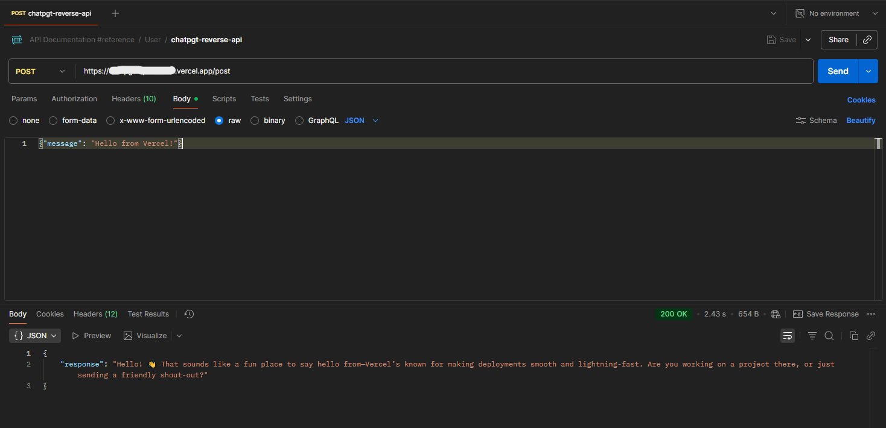

# ChatGPT Reverse API

A free, unofficial reverse-engineered API for ChatGPT.com built with Node.js. This project provides a simple HTTP server that allows you to interact with ChatGPT without requiring an API key.



## ⚠️ IMPORTANT DISCLAIMER

**THIS PROJECT IS FOR TESTING AND EDUCATIONAL PURPOSES ONLY!**

- ❌ **DO NOT USE IN PRODUCTION**
- ❌ **DO NOT ABUSE THIS API**
- ⚠️ This repository is **NOT ACTIVELY MAINTAINED**
- ⚠️ May **FAIL** when ChatGPT changes their API payload or token algorithm
- ⚠️ We are **NOT RESPONSIBLE** for any misuse or consequences
- ✅ Use at your own risk and comply with OpenAI's Terms of Service

This is a simple implementation. If you need more features, feel free to extend it or use OpenAI's official API for production applications.

## Features

- 🚀 No API key required
- 🔄 Reverse-engineered ChatGPT.com API
- 🌐 Simple HTTP REST interface
- 🔒 Built-in security headers and CORS support
- 🎭 IP spoofing and header simulation
- 🔐 Automatic CSRF and Sentinel token handling
- 🌍 Proxy support configured

## Prerequisites

- Node.js (v14 or higher)
- npm or yarn

**Note:** This project uses only Node.js built-in modules (`http`, `https`, `crypto`), so no additional dependencies need to be installed.

## Installation

1. Clone the repository:
```bash
git clone https://github.com/FurqanAhmadKhan/Chatgpt-Reverse-API.git
cd Chatgpt-Reverse-API
```

2. No dependencies to install! This project uses only Node.js built-in modules:
   - `http` - HTTP server
   - `https` - HTTPS requests
   - `crypto` - Cryptographic functions

3. Start the server:
```bash
node index.js
```

## Configuration

The API comes pre-configured with the following settings:

- **Server Port**: 3000 (configurable via `PORT` environment variable)
- **Proxy**: 
  - Host: `sg5.datafrenzy.org`
  - Port: `20571`

### Changing the Port

To change the server port, set the `PORT` environment variable:
```bash
PORT=8080 node index.js
```

### Changing the Proxy

⚠️ **If the API is slow, consider changing the proxy!**

The default proxy is **FREE** and may be slow. Free proxies are generally slower than paid proxies.

To change the proxy, edit the `CONFIG` object in `index.js`:

```javascript
const CONFIG = {
  proxy: {
    host: 'your-proxy-host.com',  // Change this
    port: 8080                      // Change this
  },
  server: {
    port: process.env.PORT || 3000
  }
};
```

**Proxy Performance Tips:**
- Free proxies = Slower response times
- Paid proxies = Faster, more reliable
- Consider using premium proxy services for better performance
- Test different proxies to find the best speed for your location

## Deployment on Vercel

You can deploy this API on Vercel to access it from any device.

### Prerequisites

Install Vercel CLI globally (one-time setup):
```bash
npm install -g vercel
```

**Note:** The `-g` flag installs Vercel CLI globally on your system, not as a project dependency.

### Deployment Steps

1. **Login to Vercel** (first time only):
```bash
vercel login
```

2. **Deploy the project**:
```bash
vercel
```

Follow the prompts:
- Set up and deploy? **Y**
- Which scope? Select your account
- Link to existing project? **N**
- What's your project's name? (press Enter for default)
- In which directory is your code located? **.**
- Want to override settings? **N**

3. **Deploy to production**:
```bash
vercel --prod
```

Your API will be live at: `https://your-project-name.vercel.app`

### Using the Deployed API

Replace `localhost:3000` with your Vercel URL:
```bash
curl -X POST https://your-project-name.vercel.app/post \
  -H "Content-Type: application/json" \
  -d '{"message": "Hello from Vercel!"}'
```

### Environment Variables on Vercel

To set a custom port or other environment variables:
```bash
vercel env add PORT
```

Or configure them in the Vercel dashboard under Project Settings → Environment Variables.

## Usage

### Starting the Server (Local)

```bash
node index.js
```

The server will start on `http://localhost:3000` by default.

### API Endpoint

**POST** `/post`

Send a message to ChatGPT and receive a response.

#### Request Format

```json
{
  "message": "Your question or prompt here"
}
```

#### Response Format

```json
{
  "response": "ChatGPT's response here"
}
```

#### Error Response

```json
{
  "error": "Error message description"
}
```

### Example Usage

#### Using cURL

```bash
curl -X POST http://localhost:3000/post \
  -H "Content-Type: application/json" \
  -d '{"message": "What is the capital of France?"}'
```

#### Using JavaScript (fetch)

```javascript
fetch('http://localhost:3000/post', {
  method: 'POST',
  headers: {
    'Content-Type': 'application/json'
  },
  body: JSON.stringify({
    message: 'What is the capital of France?'
  })
})
  .then(response => response.json())
  .then(data => console.log(data.response))
  .catch(error => console.error('Error:', error));
```

#### Using Python (requests)

```python
import requests

url = 'http://localhost:3000/post'
payload = {'message': 'What is the capital of France?'}

response = requests.post(url, json=payload)
print(response.json()['response'])
```

#### Using Node.js (axios)

```javascript
const axios = require('axios');

axios.post('http://localhost:3000/post', {
  message: 'What is the capital of France?'
})
  .then(response => {
    console.log(response.data.response);
  })
  .catch(error => {
    console.error('Error:', error.message);
  });
```

## How It Works

This API reverse-engineers the ChatGPT.com web interface by:

1. **Generating Device IDs**: Creates unique device identifiers for each request
2. **Fetching CSRF Tokens**: Obtains Cross-Site Request Forgery tokens
3. **Solving Sentinel Challenges**: Completes proof-of-work challenges required by ChatGPT
4. **Simulating Browser Headers**: Mimics legitimate browser requests
5. **IP Spoofing**: Rotates IP addresses to avoid rate limiting
6. **Streaming Responses**: Handles Server-Sent Events (SSE) for real-time responses

## API Response Codes

- `200` - Success
- `400` - Bad Request (missing message field)
- `404` - Not Found (invalid endpoint)
- `500` - Internal Server Error (ChatGPT API error)

## Limitations

- ⚠️ **This repository is NOT maintained** - may break without notice
- ⚠️ **Will fail when ChatGPT changes** their API payload or token algorithm
- This is an unofficial API and may break if ChatGPT.com changes their implementation
- Rate limiting may apply based on usage patterns
- No conversation history is maintained between requests
- Responses are anonymous (no user account required)
- **NOT suitable for production environments**

## Security Considerations

- ⚠️ **FOR TESTING PURPOSES ONLY** - Not for production use
- This API bypasses ChatGPT's official authentication
- Use responsibly and in accordance with OpenAI's terms of service
- **DO NOT ABUSE** - Respect rate limits and usage policies
- We are **NOT RESPONSIBLE** for any misuse or violations
- Consider using OpenAI's official API for any commercial or production applications

## Troubleshooting

### Server won't start
- Ensure port 3000 is not already in use
- Check that Node.js is properly installed: `node --version`

### Request fails with 500 error
- ChatGPT.com may have changed their API structure
- Check your internet connection
- Verify the proxy configuration is correct

### API is very slow
- **The default proxy is FREE and may be slow**
- Free proxies have slower response times than paid proxies
- Change the proxy in `index.js` CONFIG object to a faster one
- Consider using a paid proxy service for better performance

### No response received
- Ensure your request includes the `message` field
- Check that Content-Type header is set to `application/json`
- Try changing the proxy if requests are timing out

## Contributing

Contributions are welcome! Please feel free to submit a Pull Request.

1. Fork the repository
2. Create your feature branch (`git checkout -b feature/AmazingFeature`)
3. Commit your changes (`git commit -m 'Add some AmazingFeature'`)
4. Push to the branch (`git push origin feature/AmazingFeature`)
5. Open a Pull Request

## Disclaimer

**⚠️ PLEASE READ CAREFULLY:**

- This project is **STRICTLY FOR TESTING AND EDUCATIONAL PURPOSES ONLY**
- **NOT INTENDED FOR PRODUCTION USE** - Use OpenAI's official API instead
- This repository is **NOT ACTIVELY MAINTAINED** and may break at any time
- **WILL FAIL** when ChatGPT updates their API payload structure or token generation algorithm
- We are **NOT RESPONSIBLE** for any consequences, damages, or violations resulting from the use of this code
- **DO NOT ABUSE** this API - respect rate limits and usage policies
- Not affiliated with, endorsed by, or officially connected with OpenAI
- Use at your own risk and ensure full compliance with OpenAI's Terms of Service
- By using this code, you accept all responsibility for your actions

## Extensibility

This is a **simple, basic implementation**. If you need more features such as:
- Conversation history
- Multiple model support
- Streaming responses to client
- Authentication
- Rate limiting
- Logging and monitoring

Feel free to fork and extend the codebase, or consider using OpenAI's official API for robust production applications.

## Author

Built with ❤️ by [FurqanAhmadKhan](https://github.com/FurqanAhmadKhan)

**If you find this useful, please follow and ⭐ star the repository!**

## Links

- [GitHub Repository](https://github.com/FurqanAhmadKhan/Chatgpt-Reverse-API)
- [Report Issues](https://github.com/FurqanAhmadKhan/Chatgpt-Reverse-API/issues)

## Acknowledgments

- OpenAI for creating ChatGPT
- The open-source community for reverse-engineering efforts

---

## Final Notes

- 🧪 **Testing purposes only** - Do not use in production
- 🚫 **Do not abuse** - Respect the service and other users
- 💔 **Not maintained** - May break when ChatGPT updates their systems
- 🔧 **Extensible** - Fork and add features as needed
- ☁️ **Deploy on Vercel** - Use from any device
- ⭐ **Star if useful** - Follow [@FurqanAhmadKhan](https://github.com/FurqanAhmadKhan) for more projects

Built with ❤️ by [FurqanAhmadKhan](https://github.com/FurqanAhmadKhan)

**We are NOT responsible for any consequences of using this code. Use at your own risk!**
